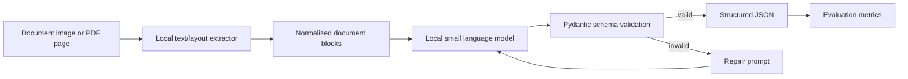

# Local Document Intelligence Pipeline

A privacy-first, zero-cost document intelligence pipeline for UK invoices and receipts.
It extracts text/layout locally, asks a small local LLM to produce strict JSON, validates
the result with Pydantic, and benchmarks field-level extraction accuracy against ground truth.

No document images or extracted text need to leave your machine.

## Why This Project Exists

Sensitive financial and legal documents should not have to leave a local machine just to
be parsed into structured data. This project explores a fully local approach for UK
invoices and receipts, with explicit validation and benchmark reporting rather than
unverified model output.

It demonstrates:

- Local inference architecture with no paid APIs.
- Document extraction from messy real-world inputs.
- Prompting for structured JSON, not free-form chat.
- Validation and repair loops for unreliable model output.
- Field-level benchmarking and failure analysis.
- A lightweight CLI and Streamlit demo suitable for GitHub reviewers.

## Tech Stack

| Layer | Tools |
| --- | --- |
| Language | Python 3.10+ |
| Packaging | Hatchling, pyproject.toml |
| CLI | Typer, Rich |
| UI | Streamlit |
| OCR | RapidOCR, optional PaddleOCR |
| Local LLM | Ollama with Qwen 2.5 0.5B |
| Validation | Pydantic |
| Evaluation | Field-level accuracy, numeric tolerance, string similarity |
| Testing and linting | Pytest, Ruff |
| CI | GitHub Actions |

## Architecture



## Quick Start

```powershell
python -m venv .venv
.venv\Scripts\Activate.ps1
python -m pip install --upgrade pip
python -m pip install -e ".[dev,ui]"
```

Run the sample pipeline in mock mode:

```powershell
docintel extract data\samples\invoice_001.txt --extractor text --llm heuristic
```

Generate a public-safe synthetic benchmark set:

```powershell
docintel generate-samples
```

Run batch extraction across the benchmark:

```powershell
docintel batch data\samples --pattern *.txt --extractor text --llm heuristic --output outputs\heuristic_predictions.json
```

Evaluate predictions against ground truth:

```powershell
docintel evaluate data\ground_truth.json --predictions outputs\heuristic_predictions.json
```

Launch the local demo:

```powershell
streamlit run app\streamlit_app.py
```

On Windows, if PowerShell blocks virtual environment activation, run the same commands
through the venv executables:

```powershell
.venv\Scripts\python.exe -m pip install -e ".[dev,ui]"
.venv\Scripts\streamlit.exe run app\streamlit_app.py
```

## Optional Local LLM Setup

Install Ollama, then pull a small instruct model:

```powershell
ollama pull qwen2.5:1.5b
```

Run extraction with Ollama:

```powershell
docintel batch data\samples --pattern *.txt --extractor text --llm ollama --model qwen2.5:0.5b --output outputs\qwen_0_5b_predictions.json
docintel evaluate data\ground_truth.json --predictions outputs\qwen_0_5b_predictions.json
```

## Optional OCR Setup

For local OCR, install the OCR extras:

```powershell
python -m pip install -e ".[ocr]"
```

Then run:

```powershell
docintel batch data\sample_images --pattern *.png --extractor rapidocr --llm ollama --model qwen2.5:0.5b --output outputs\qwen_0_5b_ocr_predictions.json
docintel evaluate data\ground_truth.json --predictions outputs\qwen_0_5b_ocr_predictions.json
```

The default repository stays lightweight. OCR and VLM dependencies are optional because
they are larger and more sensitive to hardware/platform setup.

## Schema

The extraction target is UK-oriented:

```json
{
  "document_type": "invoice",
  "supplier_name": "Acme Services Ltd",
  "supplier_address": "10 Example Street, London, EC1A 1AA",
  "vat_number": "GB123456789",
  "invoice_number": "INV-001",
  "invoice_date": "2026-01-31",
  "subtotal_gbp": 100.0,
  "vat_amount_gbp": 20.0,
  "total_amount_gbp": 120.0,
  "currency": "GBP",
  "confidence": 0.88
}
```

## Evaluation

The evaluator reports exact-match accuracy for categorical fields, numeric tolerance for
money fields, date accuracy for normalized dates, and normalized string similarity for names
and addresses.

Current synthetic benchmark:

| Backend | Documents | Overall |
| --- | ---: | ---: |
| Heuristic fallback | 8 | 1.00 |
| Ollama Qwen 2.5 0.5B on text | 8 | 1.00 |
| RapidOCR + Ollama Qwen 2.5 0.5B on images | 8 | 1.00 |

Example output:

```text
supplier_name       1.00
invoice_date        1.00
total_amount_gbp    1.00
vat_number          1.00
overall             1.00
```

## Roadmap

- Test harder OCR inputs with blur, rotation, shadows, and lower resolution.
- Add a Donut OCR-free experimental extractor backend.
- Add PDF page rendering.
- Add confidence calibration from validation and model self-checks.
- Expand benchmark set with more difficult UK invoices and receipts.

## Repository Guide

See [docs/project_structure.md](docs/project_structure.md) for the package layout and
[docs/benchmark_workflow.md](docs/benchmark_workflow.md) for the benchmark workflow.
